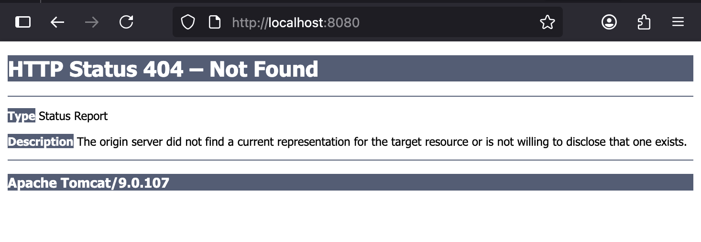
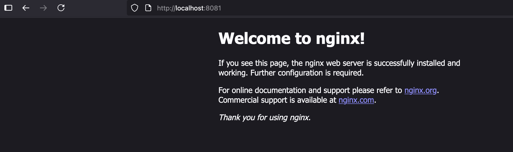
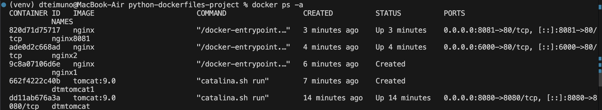
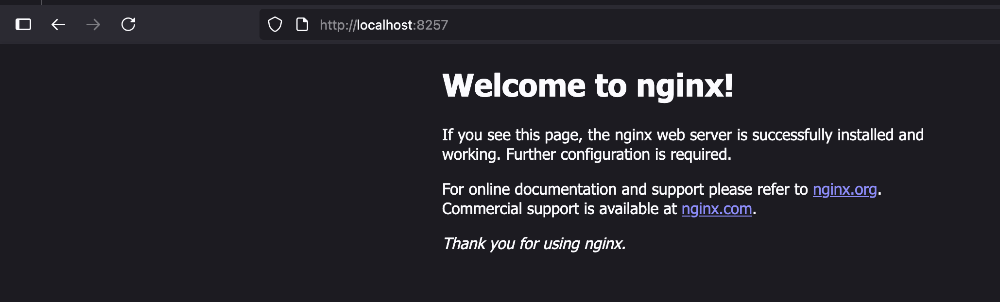
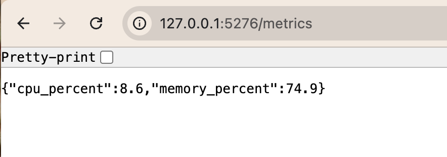
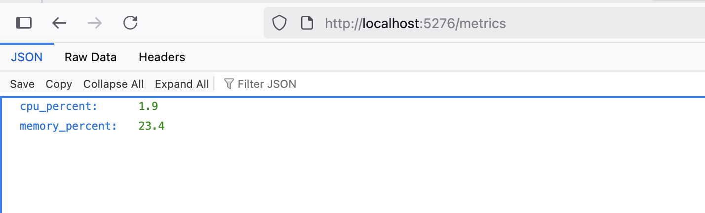

# Docker Python SDK For Managing Docker Containers and Python For Creating Docker Flask Image Measuring CPU and Memory Utilization


- This two-part project shows how I explored the Docker python SDK and then built a containerized application using the python flask module that checks for CPU utilization and memory use.
## Part 1: Docker Python SDK For Managing Containers and Container Orchestration 
  
- To start, we will create a virtual environment:
```
# Step 1: Create a virtual environment in your project folder
python3.13 -m venv venv

# Step 2: Activate the virtual environment
source venv/bin/activate

# Step 3: Install needed packages inside the venv
pip install docker requests
```
- This is the page seen after viewing my tomcat server, it could use some work but the server being shown is good enough for me

- This is the page shown after viewing my containerized nginx on localhost:8081

- These are my containers on my local machine. I will be deleting some of them:


## Creating Service using Docker SDK
- After creating my nginx docker service I get:


## Part 2: Docker Python SDK For Creating Docker Image That Shows CPU and Memory Utilization

## Creating Local Flask app and testing

After using my flask setup I got the following with the following code below I got the following result on the metric route:
```
import psutil
from flask import Flask, jsonify  

app = Flask(__name__)

@app.route('/metrics')
def system_metrics():
    cpu = psutil.cpu_percent(interval=1)  
    memory = psutil.virtual_memory().percent

    print(f"CPU Utilization: {cpu}%")
    print(f"Memory Utilization: {memory}%")

    return jsonify({
        'cpu_percent': cpu,
        'memory_percent': memory
    })

if __name__ == '__main__':
    app.run(host='0.0.0.0', port=5276)
```


- I then built up my image and run it locally using the following script:
```
#!/bin/bash
docker build -t psutil-flask .
# Run the container
docker run -d -p 5276:5276 psutil-flask
```


# Sources
[Docker-containers python SDK documentation](https://docker-py.readthedocs.io/en/latest/containers.html)
[Docker Swarm Documentation](https://docker-py.readthedocs.io/en/latest/swarm.html)
[Docker Service Documentation](https://docker-py.readthedocs.io/en/latest/services.html)

